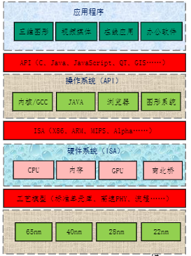

# 引言
---
## PPT翻页过程
1. **硬件过程**
2. **软件过程**
3. **PPT翻页卡顿原因**
   1. 系统中有其他任务运行
   2. 图形多，GPU太忙
   3. 内容多，内存带宽不足
   4. 在独立显存的情况下，数据从内存到显存需要专门的机制，如直接内存访问(DMA)

## 冯诺依曼结构的优缺点
1. **本质特征：** 存储程序和指令驱动执行
2. **优点：** 自动、快速执行
3. **缺点：** 指令驱动顺序执行，CPU和存储器分开且越来越远

## 计算机的性能
1. 定义：完成一个任务所需的时间
2. $CPUtime = \frac{Seconds}{Program} = \frac{Instrutions}{Program} = \frac{Instructions}{Program} \times \frac{Cycles}{Instructions} \times \frac{Seconds}{Cycles}$

## 作业
1. 计算机系统可以分为**应用程序、操作系统、硬件系统、晶体管**四个层次。第一个界面是**应用程序编程接口API**，介于应用程序和操作系统之间；第二个界面是**指令系统ISA**，介于操作系统和硬件系统之间；第三个界面是**工艺模型**，介于硬件系统和晶体管之间。
   
2. $MIPS=\frac{instractions}{exectime*10^6}$(每秒执行百万条指令数) 
   $MIPS=\frac{clock rate}{CPI*10^6}$(clock rate:主频，CPI:每条指令的平均时钟周期数) 
   $CPI=\frac{总周期数}{总指令数}$ 

3. 设程序执行 时间为1，可向量化时间为P，不可向量化时间为1-P，加速比为S，则可向量化时间为P/S，所以总执行时间为1-P+P/S。
4. 静态等效电阻为10Ω，1GHz，1.1V,动态电流为$2100mA-110mA=1990mA$，动态功耗与主频成正比，所以2GHz，1.1V的动态电流为$1990*2=3980mA$，总电流为$3980+110=4090mA$，总功耗：$1.1V*4090mA=4.499W$
   