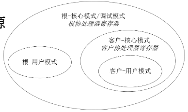
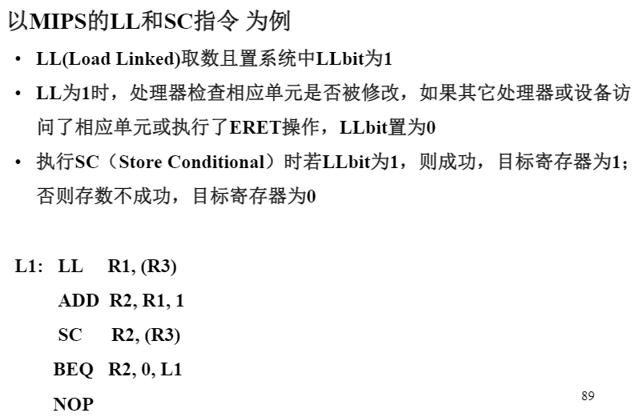

# 指令系统
---
## 指令系统简介
1. 指令系统是软硬件界面，起到承上启下的作用。指令系统决定了应用程序的二进制兼容，是操作系统二进制兼容的重要因素。指令系统会影响系统的性能和实现的复杂性。
2. 主流指令系统：X86(PC和服务器市场)、ARM(手持终端)和MIPS(数字电视、机顶盒、打印机等传统市场)
##影响指令系统设计的因素
1. 工艺技术
由于CPU与存储器的速度差距，指令系统应能较好地利用存储层次，如通过并行或流水容忍延迟
2. 系统结构
指令系统的兼容性要求与系统结构发展的矛盾关系
3. 操作系统
多进程支持、虚地址空间、安全等级、虚拟机等
4. 编译技术和程序设计语言
指令的表达能力
5. 应用程序
应用适应性、兼容性等

## 指令系统的演变
1. 分类
   **CISC:** 复杂指令系统，指令长度可变(x86:1~15字节)
   **RISC:**精简指令系统，指令长度比较固定
   **VLIW:**超长指令字，本质是多条同时执行指令的组合。
2. CISC的问题：复杂的指令很少用到，且增加了流水线设计的难度，降低了常用简单指令的执行效率。
3. RISC针对简化：单个指令执行周期短；使用定长指令，译码简单；访存只能通过load-store指令实现。有利于实现高效流水线、多发射等技术，从而提高主频和效率。
4. VLIW可显著简化硬件实现，但增加了编译器的设计难度。

## 存储管理的演变
1. 存储管理经历了**连续实地址、段式、页式虚拟存储、段页式**等阶段。

## 运行级别的演变
1. 经历了**唯一实模式(无管理)、保护模式(核心态-用户态)、调试模式(方便硬件调试)、客户模式(虚拟化技术支持服务器)**等阶段。
2. MIPS运行模式
   

## 指令系统的组成
1. CPU、操作、操作数
2. 大尾端：最高有效字节(越前面有效位越高)地址小的是大尾端
3. 小尾端：最低有效字节地址小是小尾端
4. 0X12345678
   小尾端：78·56·34·12
   大尾端：12·34·56·78
5. 寻址方式：**立即数寻址、寄存器寻址、偏移量寻址、**寄存器直接寻址和寄存器间接寻址等
6. Byte：1字节，halfWord：2字节，Word：4字节

## MIPS指令
1. 不对齐访存指令：LWL(把最低位字节拼到目标的高位)、LWR(把最高位字节拼到目标的低位)
2. 原子指令：LL/SC
   

---
## 作业
1. MIPS处理器，运行级别主要包括：调试模式、根模式和客户模式。根模式和客户模式分别包括核心模式、用户模式和监管模式。在处理器上电复位处于根-核心模式，随后根据需要转移到其他模式。所有模式相互独立。
2. C语言描述段页式存储。
   **段页式存储**虚拟地址分为段号、虚拟页号、页内偏移三部分。
   地址转换：
      1. 检查段地址的合法性 
      2. 根据段号查询段表，得到对应段的页表的起始地址。
      3. 根据虚拟页号查询页表得到物理页号。
      4. 物理页号和业内偏移得到最终的物理地址。
      ```C
      typedef struct{
         int seg;
         int vpage;
         int offset;
      }vaddr;

      typedef struct{
         int ppage;
         int offset;
      }paddr;

      typedef struct{
         int lenth;//segment lenth
         int ptr;//base address
      }seg_entry;

      typedef struct{
         int flag;
         int ppage;
      }page_entry;

      seg_entry segtbl[N_seg];
      page_entry pagetbl[N_seg][N_page];

      paddr_Translate(vaddr vaddr_in){
         paddr paddr_out;
         if(vaddr_in.seg > N_seg){
            ERROR(no such segment!);
         }
         if(vaddr_in.vpage > segtbl[vaddr
         _in.seg].length){
            ERROR(segment default);
         }
         paddr_out.offset = vaddr_in.offset;
         paddr_out.ppage = pagetbl[segtbl[vaddr_in.seg].ptr][vaddr_in.vpage];
         return paddr_out;
      }
      //假设flag为有效的情况
      ```
3. 简述翻一页PPT核心态和用户态相互转换的过程。
   等待按键-**中断处理**-准备数据-**操作显存**-返回PPT
   **核心态：中断和操作显存**
4. 待解决
5. 0xDEADBEEF</br>
   地址：0·1·2·3</br>
   **小尾端：** EF·BE·AD·DE(最低有效位在低地址)</br>
   **大尾端：** DE·AD·BE·EF

6. 无
7. 间接跳转：16位有符号立即数`newPC = oldPC+(imm16*4)` ；直接跳转：26位无符号立即数`{newPC = oldPC[31:28],imm26,2'b0}`
8. 