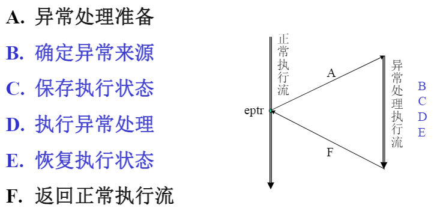

# 特权指令系统

---
## 特权指令系统
1. 对运行模式进行定义和切换
2. 对虚拟存储进行管理(TLB，与存储相关的控制寄存器)
3. 处理异常和中断

## 异常和中断
1. 外部事件(I/O设备)
2. 指令执行中的错误(操作码操作数的错误)
3. 数据完整性(ECC或奇偶校验错误)
4. 地址转换异常(没有有效TLB项，TLB的异常)
5. 系统调用和陷入(保护模式下调用核心态)
6. 需要软件修正(浮点运算指令的异常)

## 异常处理

## 中断传递
1. 中断线
2. 中断消息(MSI)

## 虚拟存储
1. TLB 
   TLB是页表的Cache. 
   TLB 内容：虚地址、物理地址、保护位
   读TLB的PFN(物理帧号)、C、D、V位，TLB异常的情况，不命中(TLB refill)，V为0(TLB invilid)，V为1、D为0(TLB modify).